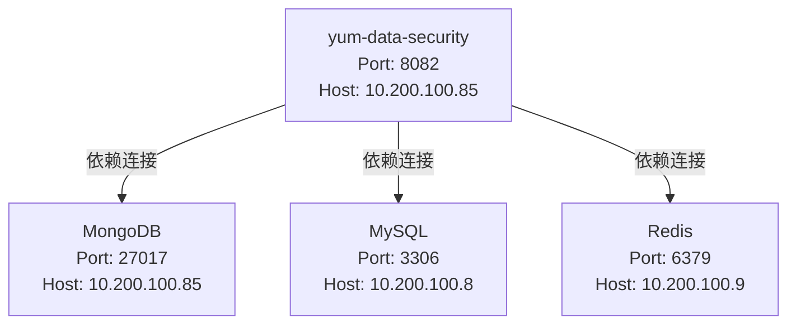

# 项目运维手册

## 架构拓扑

### Servers
| Server 名称 | Host/IP | 用途 |
|---|---|---|
| dev-server-01 | 10.200.100.85 | 应用服务器 (承载 yum-data-security) |
| db-mysql-01 | 10.200.100.8 | MySQL 数据库服务器 |
| cache-redis-01 | 10.200.100.9 | Redis 缓存服务器 |

### Services
| Service 名称 | 类型 | 所在 Server | 端口 | 说明 |
|---|---|---|---|---|
| yum-data-security | Spring Boot | dev-server-01 | 8082 | 业务应用容器 |
| mongodb | Database | dev-server-01 | 27017 | MongoDB 数据库服务 |
| mysql | Database | db-mysql-01 | 3306 | MySQL 数据库服务 |
| redis | Cache | cache-redis-01 | 6379 | Redis 缓存服务 |

### 架构图

## 服务配置
| 服务名称 | 关键配置项 | 值/路径 | 备注 |
|---|---|---|---|
| yum-data-security | 启动命令 | `java -jar app.jar` | Docker 容器内执行 |
| yum-data-security | 映射端口 | 8082 (宿主机 -> 容器) | 对应业务接口 `/api/sys/check/data` |
| yum-data-security | 部署镜像标签 | `yum-data-security:dev` | 开发环境标识 |
| yum-data-security | 健康检查端点 | `/actuator/health` | Spring Boot Actuator 默认端点 |
| yum-data-security | 业务接口 | `/api/sys/check/data` | 内部校验数据接口 |

## 运维信息

### 部署方式
Docker 容器化部署 (`docker run` / `docker-compose`)

### 日志路径
| 服务 | 日志位置 | 说明 |
|---|---|---|
| yum-data-security | `docker logs yum-data-security` | 通过 Docker 命令获取容器日志 |

### 健康检查
| 服务 | 端点 | 预期响应 |
|---|---|---|
| yum-data-security | `/actuator/health` | HTTP 200 OK |